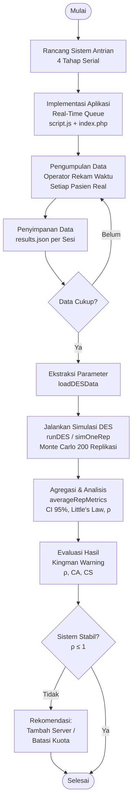
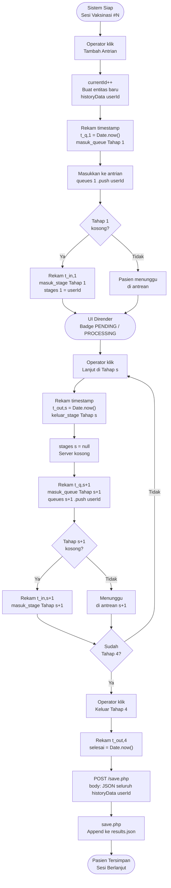
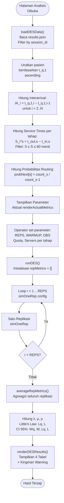
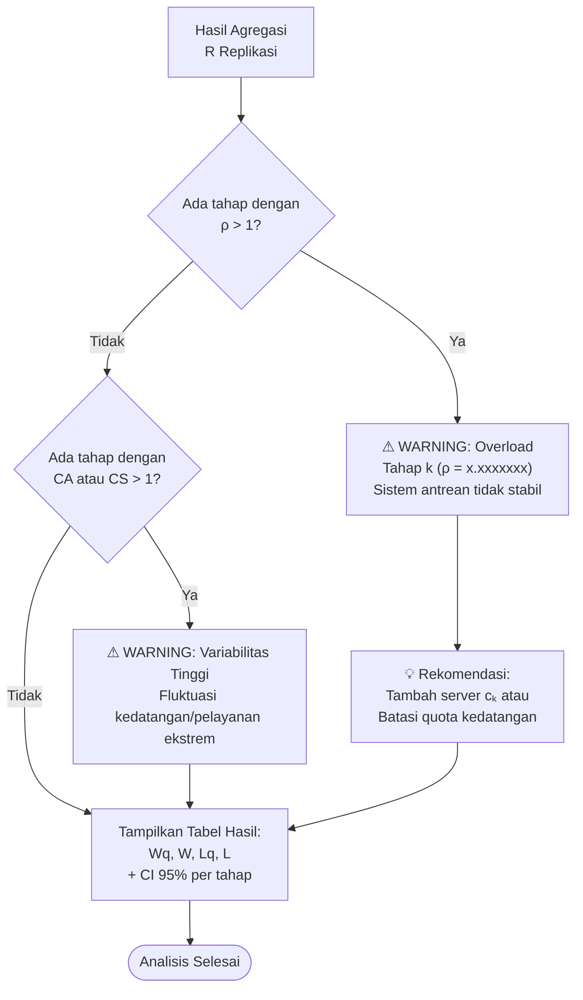
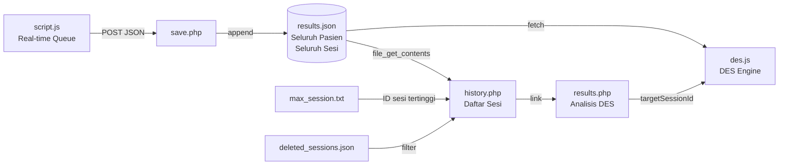
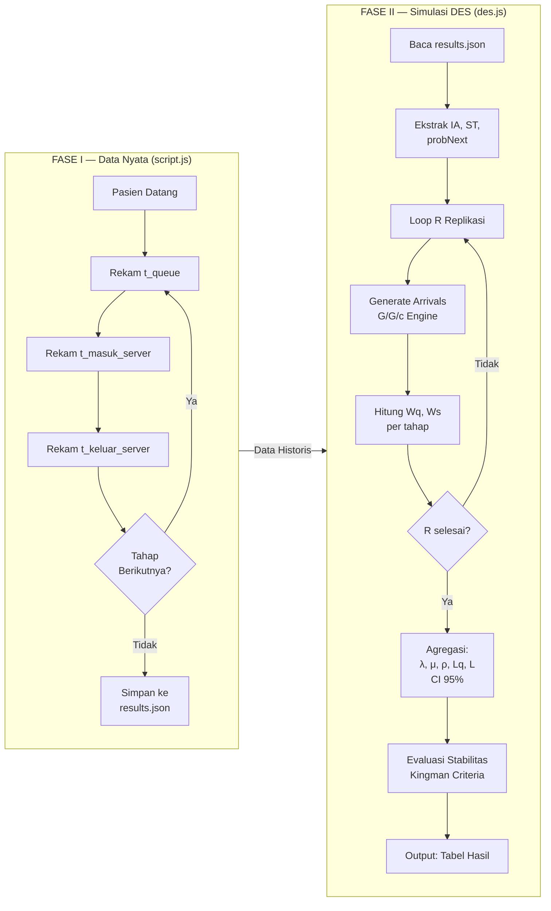

# BAB III — METODOLOGI PENELITIAN

## 3.1 Jenis Penelitian

Penelitian ini menggunakan pendekatan **simulasi komputer berbasis Discrete Event Simulation (DES)** dengan metode **Monte Carlo multi-replikasi**. Objek penelitian adalah sistem antrian pelayanan vaksinasi yang terdiri dari empat tahap proses serial (*serial multi-stage queue*). Data masukan bersifat empiris, diperoleh secara langsung melalui pencatatan waktu nyata menggunakan sistem informasi antrian yang dikembangkan khusus (*custom-built*).

---

## 3.2 Model Sistem Antrian

Sistem yang dimodelkan merupakan jaringan antrian empat tahap dengan karakteristik **G/G/c** (General Interarrival – General Service – *c* servers), yakni:

| Komponen | Notasi | Keterangan |
|---|---|---|
| Distribusi kedatangan | G (General) | Empiris, tidak diasumsikan distribusi tertentu |
| Distribusi pelayanan | G (General) | Empiris per tahap |
| Jumlah server | *c* | Dikonfigurasi per tahap (default: 1) |
| Kapasitas antrian | ∞ | Tidak dibatasi |
| Disiplin antrian | FCFS | First Come, First Served |
| Jumlah tahap | 4 | Registrasi → Pengukuran → Perekaman → Vaksinasi |
| Routing | Probabilistik | Berdasarkan data historis empiris |

---

## 3.3 Alur Prosedur Penelitian Secara Keseluruhan



---

## 3.4 Fase I — Pengumpulan Data Real-Time (`script.js`)

### 3.4.1 Deskripsi Prosedur

Fase pertama bertujuan mengumpulkan data waktu proses setiap pasien secara langsung di lapangan. Sistem diimplementasikan sebagai aplikasi web berbasis *browser* yang dioperasikan oleh petugas (*operator-driven*). Setiap kejadian (*event*) dicatat dengan presisi timestamp milidetik menggunakan `Date.now()`.

### 3.4.2 Variabel yang Direkam

Untuk setiap entitas pasien *i* di tahap *s*, sistem merekam tiga timestamp:

| Variabel | Notasi | Definisi |
|---|---|---|
| Waktu masuk antrean | $t^{(s)}_{q,i}$ | Saat pasien bergabung ke antrean tahap *s* |
| Waktu mulai dilayani | $t^{(s)}_{in,i}$ | Saat pasien dipanggil ke server |
| Waktu selesai dilayani | $t^{(s)}_{out,i}$ | Saat pasien keluar dari server |

Dari ketiga timestamp tersebut diturunkan:

$$W_{q,i}^{(s)} = t^{(s)}_{in,i} - t^{(s)}_{q,i} \quad \text{(Waktu tunggu pasien ke-}i\text{ di tahap }s\text{)}$$

$$S_{i}^{(s)} = t^{(s)}_{out,i} - t^{(s)}_{in,i} \quad \text{(Waktu pelayanan pasien ke-}i\text{ di tahap }s\text{)}$$

### 3.4.3 Flowchart Fase I — Generate Data Real-Time



### 3.4.4 Struktur Data Keluaran Fase I

Data setiap pasien disimpan dalam format JSON berikut ke file `results.json`:

```json
{
  "id": 3,
  "session_id": 2,
  "selesai": 1714125600000,
  "history": [
    {
      "stage": 1,
      "masuk_queue":  1714120000000,
      "masuk_stage":  1714120045000,
      "keluar_stage": 1714120120000
    },
    {
      "stage": 2,
      "masuk_queue":  1714120120000,
      "masuk_stage":  1714120125000,
      "keluar_stage": 1714120180000
    },
    { "stage": 3, "...": "..." },
    { "stage": 4, "...": "..." }
  ]
}
```

> **Catatan:** Pasien yang keluar sebelum tahap 4 (drop-out) hanya memiliki entri `history` hingga tahap terakhir yang diikuti. Hal ini ditangani dalam Fase II melalui *probabilistic routing*.

---

## 3.5 Fase II — Simulasi dan Analisis DES (`des.js`)

### 3.5.1 Deskripsi Prosedur

Fase kedua adalah inti analisis kuantitatif. Sistem membaca data historis dari Fase I, mengekstrak distribusi empiris, lalu menjalankan simulasi DES secara berulang sebanyak *R* replikasi (*Monte Carlo replication*). Pendekatan ini dipilih karena distribusi interarrival dan service time tidak memenuhi asumsi distribusi teoritis tertentu (Poisson/Eksponensial), sehingga pendekatan analitik seperti M/M/c atau M/G/c tidak dapat diterapkan secara langsung.

### 3.5.2 Flowchart Fase II — Keseluruhan Proses DES



---

### 3.5.3 Tahap A — Ekstraksi Parameter Empiris (`loadDESData`)

#### A.1 Interarrival Time

Pasien diurutkan berdasarkan waktu masuk antrean tahap pertama ($t^{(1)}_{q,i}$). Selisih antar kedatangan berurutan dihitung sebagai:

$$a_i = t^{(1)}_{q,i} - t^{(1)}_{q,i-1}, \quad i = 2, 3, \ldots, N$$

Seluruh nilai $a_i$ disimpan dalam array `interarrivalSamples[]` sebagai populasi empiris yang akan *di-resample* (bootstrap) pada setiap replikasi.

#### A.2 Service Time per Tahap

Untuk setiap pasien di setiap tahap:

$$s_{i}^{(k)} = t^{(k)}_{out,i} - t^{(k)}_{in,i}, \quad k = 1,2,3,4$$

Data dengan $s < 0$ atau $s > 60$ menit dieliminasi sebagai *outlier* ekstrem (kesalahan pencatatan atau jeda yang tidak relevan).

#### A.3 Probabilitas Routing

Karena tidak semua pasien menyelesaikan seluruh 4 tahap (drop-out), peluang seorang pasien melanjutkan ke tahap berikutnya dihitung secara empiris:

$$p_k = \frac{n_k}{n_{k-1}}, \quad k = 2, 3, 4$$

di mana $n_k$ adalah jumlah pasien yang tercatat masuk ke tahap $k$.

---

### 3.5.4 Tahap B — Satu Replikasi Simulasi (`simOneRep`)

Setiap replikasi mensimulasikan $N_{total} = N_{warmup} + N_{obs}$ pasien secara sekuensial. Berikut flowchart detail satu replikasi:

```mermaid
flowchart TD
    S([Mulai Replikasi\ncurrentTime = 08:00 = 480 min]) --> A1

    subgraph ARRIVAL ["FASE ARRIVAL GENERATION"]
        A1["Loop i = 0 .. N_total - 1"] --> A2
        A2["Ambil sampel interarrival:\nIA = random sample dari interarrivalSamples\ni=0 → IA = 0"] --> A3
        A3["rawArr = currentTime + IA"] --> A4
        A4{rawArr ≥\ncurrentHourLimit?} -- Ya --> A5
        A4 -- Tidak --> A6
        A5["currentHourLimit += 60\npatientsInHourBlock = 0"] --> A4
        A6{quota > 0?} -- Ya --> A7
        A6 -- Tidak --> A9
        A7["patientsInHourBlock++"] --> A8
        A8{patientsInHourBlock\n> quota?}
        A8 -- Ya --> AQ["Geser: currentTime = currentHourLimit\ncurrentHourLimit += 60\npatientsInHourBlock = 1"]
        A8 -- Tidak --> A9
        AQ --> A9
        A9["currentTime = rawArr\ncustomers.push arrivalSystem"] --> A10
        A10{i < N_total?}
        A10 -- Ya --> A1
        A10 -- Tidak --> B1
    end

    subgraph SERVICE ["FASE SERVICE SIMULATION — PER PASIEN"]
        B1["Loop i = 0 .. N_total - 1\nambil customers[i]"] --> B2

        subgraph S1 ["TAHAP 1 — Selalu Dilalui"]
            B2["arr_1 = arrivalSystem"] --> B3
            B3["earliestServer = min server_free[1]"] --> B4
            B4["start_1 = max(arr_1, earliestServer.time)"] --> B5
            B5["Wq_1 = start_1 − arr_1\nservice_1 = random sample serviceTimes[1]"] --> B6
            B6["end_1 = start_1 + service_1\nserver_free[1][idx] = end_1"] --> C1
        end

        subgraph S2 ["TAHAP 2 — Probabilistik"]
            C1{random() ≤\nprobNext 2?}
            C1 -- Tidak --> DONE
            C1 -- Ya --> C2
            C2["arr_2 = end_1\nearliestServer = min server_free[2]\nstart_2 = max(arr_2, server)\nWq_2, service_2, end_2"] --> D1
        end

        subgraph S3 ["TAHAP 3 — Probabilistik"]
            D1{random() ≤\nprobNext 3?}
            D1 -- Tidak --> DONE
            D1 -- Ya --> D2
            D2["arr_3 = end_2\nstart_3, Wq_3, service_3, end_3"] --> E1
        end

        subgraph S4 ["TAHAP 4 — Probabilistik"]
            E1{random() ≤\nprobNext 4?}
            E1 -- Tidak --> DONE
            E1 -- Ya --> E2
            E2["arr_4 = end_3\nstart_4, Wq_4, service_4, end_4"]
            E2 --> DONE
        end

        DONE["Simpan stages[1..4]\nuntuk customers[i]"] --> B10
        B10{i < N_total?}
        B10 -- Ya --> B1
        B10 -- Tidak --> C_END
    end

    subgraph WARMUP ["WARMUP FILTERING"]
        C_END["obsCustomers =\ncustomers.slice(N_warmup, N_warmup + N_obs)"] --> D_END
    end

    subgraph METRIC ["PERHITUNGAN METRIK"]
        D_END["Per tahap, hitung dari obsCustomers:\nWq = mean wait time\nWs = mean service time\nAi, σAi, Si, σSi"] --> RETURN
        RETURN["Kembalikan metrics object\nper replikasi"] --> E_END
    end

    E_END([Replikasi Selesai])
```

#### Formula Waktu Mulai Pelayanan (G/G/c)

Untuk pasien ke-*i* di tahap *k* dengan *c* server tersedia:

$$t^{(k)}_{in,i} = \max\!\left(t^{(k)}_{arr,i},\; \min_{j=1..c}\left\{t^{(k)}_{free,j}\right\}\right)$$

Server yang dipilih adalah server dengan waktu bebas (*free time*) paling awal, kemudian di-*update*:

$$t^{(k)}_{free,j^*} \leftarrow t^{(k)}_{in,i} + s^{(k)}_i$$

---

### 3.5.5 Tahap C — Agregasi Multi-Replikasi (`averageRepMetrics`)

Setelah *R* replikasi selesai, dilakukan agregasi untuk memperoleh estimasi titik (*point estimate*) dan selang kepercayaan (*confidence interval*).

#### Estimasi Titik

$$\bar{W}_q^{(k)} = \frac{1}{R}\sum_{r=1}^{R} \widehat{W}_{q,r}^{(k)}, \quad k = 1,2,3,4$$

Selanjutnya diturunkan parameter operasional sistem:

| Parameter | Formula |
|---|---|
| Laju kedatangan | $\lambda^{(k)} = 1 / \bar{A}_i^{(k)}$ |
| Laju pelayanan | $\mu^{(k)} = 1 / \bar{S}_i^{(k)}$ |
| Utilisasi server | $\rho^{(k)} = \lambda^{(k)} / \left(c_k \cdot \mu^{(k)}\right)$ |
| Panjang antrean (Little) | $L_q^{(k)} = \lambda^{(k)} \cdot W_q^{(k)}$ |
| Panjang sistem (Little) | $L^{(k)} = \lambda^{(k)} \cdot W^{(k)}$ |
| Koef. variasi kedatangan | $CA_i^{(k)} = \sigma_{A_i}^{(k)} / \bar{A}_i^{(k)}$ |
| Koef. variasi pelayanan | $CS_i^{(k)} = \sigma_{S_i}^{(k)} / \bar{S}_i^{(k)}$ |

#### Selang Kepercayaan 95%

Selang kepercayaan dihitung menggunakan distribusi *t*-Student dengan $df = R - 1$ derajat kebebasan:

$$CI_{95\%}(\theta) = \bar{\theta} \pm t_{\alpha/2, R-1} \cdot \frac{s_\theta}{\sqrt{R}}$$

di mana $s_\theta$ adalah standar deviasi sampel dari *R* estimasi replikasi untuk metrik $\theta$. Untuk $R \geq 30$ (berlaku $df \geq 29$), digunakan nilai asimptotik $t = 1{,}96$.

Metrik yang dihitung CI-nya: $W_q^{(k)},\; W^{(k)},\; L_q^{(k)},\; L^{(k)}$ untuk setiap tahap $k$.

---

### 3.5.6 Tahap D — Evaluasi Stabilitas Sistem (Kingman Criteria)

Setelah simulasi, sistem dievaluasi terhadap dua indikator ketidakstabilan:

#### Kriteria 1 — Utilisasi Overload

$$\rho^{(k)} > 1 \Rightarrow \text{Sistem tidak stabil pada Tahap } k$$

Jika $\rho > 1$, laju kedatangan melebihi kapasitas pelayanan. Dalam DES komputer (berbeda dari formula analitik), kondisi ini disimulasikan sebagai penumpukan antrean yang terus bertambah (*unbounded queue*).

#### Kriteria 2 — Koefisien Variasi Tinggi

$$CA_i^{(k)} > 1 \;\text{atau}\; CS_i^{(k)} > 1 \Rightarrow \text{Variabilitas tinggi pada Tahap } k$$

Jika CV > 1, distribusi bersifat *hyperexponential* (sangat fluktuatif), berpotensi memperparah penumpukan antrean meskipun $\rho < 1$.



---

## 3.6 Parameter Simulasi Default

| Parameter | Simbol | Nilai Default | Keterangan |
|---|---|---|---|
| Jumlah replikasi | *R* | 200 | Jumlah ulangan Monte Carlo |
| Periode warmup | $N_w$ | 10 | Pasien yang dibuang di awal (eliminasi bias transient) |
| Periode observasi | $N_{obs}$ | 30 | Pasien yang dianalisis per replikasi |
| Total pasien per rep | $N_{total}$ | $N_w + N_{obs} = 40$ | |
| Kuota per jam | — | 0 (nonaktif) | Pembatasan kedatangan per blok 60 menit |
| Server per tahap | $c_k$ | 1 | Dikonfigurasi masing-masing |

---

## 3.7 Mekanisme Penyimpanan Data

Sistem menggunakan arsitektur *flat-file* tanpa basis data relasional:



---

## 3.8 Ringkasan Alur Metodologi


